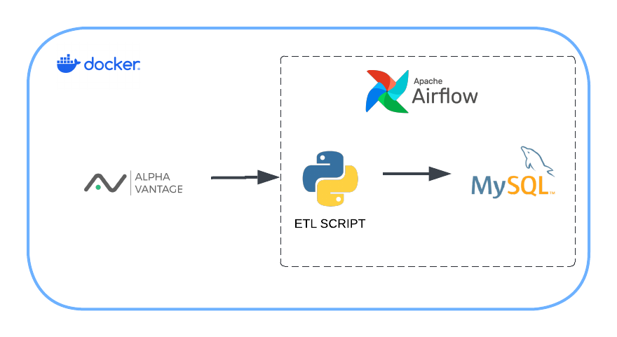

# **Stock Market Data Pipeline**

## **Overview**
This Data engineering project implements a stock market data pipeline that automates the process of extracting, transforming, and loading (ETL) daily stock data for analysis or other applications. Built with Apache Airflow, MySQL, and Docker, the pipeline is designed to handle large volumes of stock data efficiently and enables analysis through calculated technical indicators.

## **Project Objectives**
- Automate the ETL process for daily stock data in a docker environment.
- Store and manage stock data in a MySQL database.
- Calculate key technical indicators for data analysis.

## **Project Architecture**
The architecture consists of the following components:
- **Apache Airflow**: Orchestrates ETL workflows.
- **MySQL**: Stores processed stock data.
- **Python**: Scripts for extracting, transforming, and loading data.
- **Docker**: Ensures consistency in the development and deployment environment.

## **Pipeline Workflow**
The pipeline performs the following steps for each stock:
1. **Extract**: Downloads daily stock data from ALPHA VANTAGE API https://www.alphavantage.co/ and store it in a dataframe.
2. **Transform**: Cleans data (date ,open_price,high,low,volume ,close_price) and computes technical indicators (SMA, EMA, RSI, MACD).
3. **Load**: Inserts data into MySQL with update functionality to avoid duplicates.

---

### **Prerequisites**
- Docker and Docker Compose
- Apache Airflow (preconfigured to use CeleryExecutor)
- Python 3.7+

### **Project Files**
- materials/dags/dags.py: Main Airflow DAG for orchestrating the ETL pipeline.
- materials/dags/extract_stocks.py: Python functions for extracting, transforming, and loading stock data, with technical   indicator calculations.
- docker-compose.yml: Docker configuration for Airflow, MySQL, Redis, and phpMyAdmin.
- init.sql: SQL script to initialize the MySQL database schema and tables.
- env: (Optional) Stores environment variables for Airflow and MySQL.

## **Contact**
For questions or suggestions, please reach out to [saad](mailto:fsaad1929@gmail.com).
